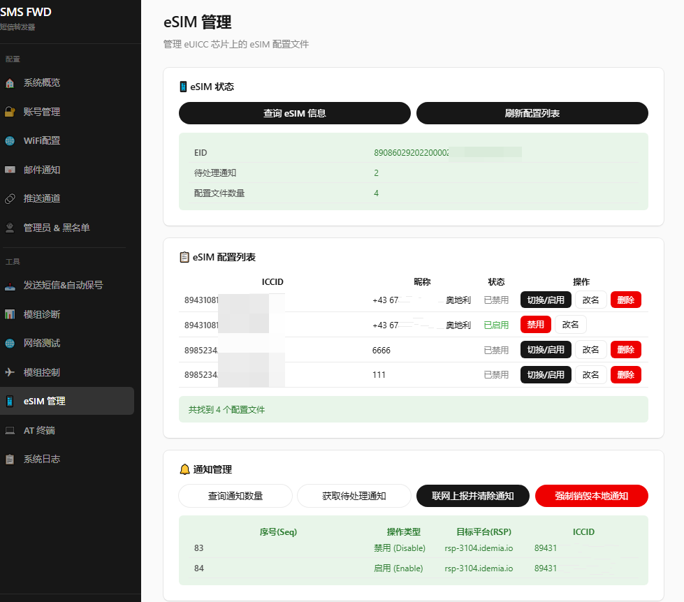
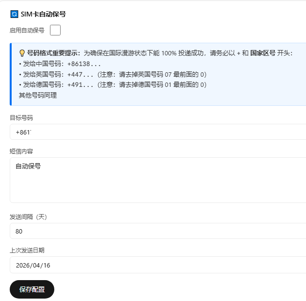
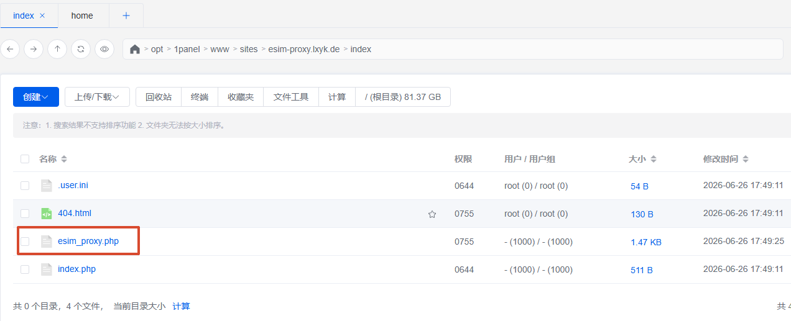
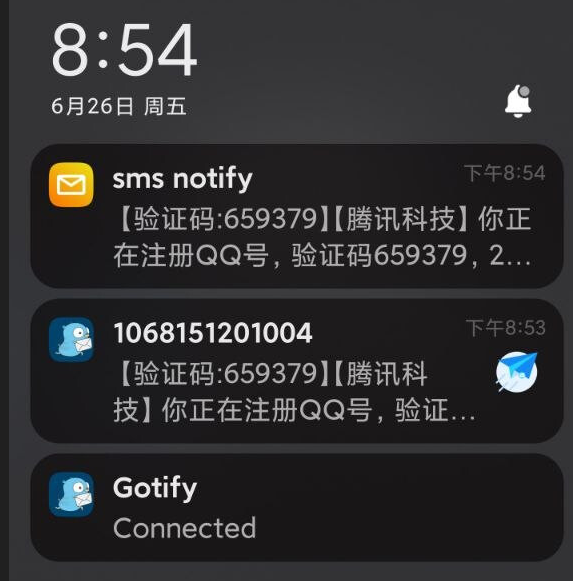
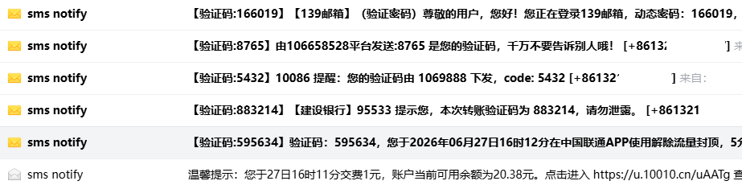
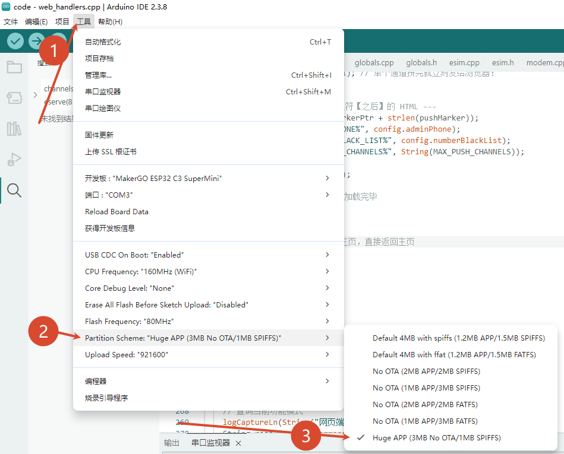

# 低成本短信转发器

> 本项目修改自linuxdo大佬的[项目](https://github.com/chenxuuu/sms_forwarding)

本项目仅用于接收短信与进行保号相关功能。  



本项目旨在使用低成本的硬件设备，实现短信的自动转发功能，支持多种推送方式同时启用。

> 视频教程：[B站视频](https://www.bilibili.com/video/BV1cSmABYEiX)


## 功能

- 支持使用通用AT指令与模块进行通信
- 开启后支持通过WEB界面配置短信转发参数、查询当前状态
- **支持多达5个推送通道同时启用**，每个通道可独立配置
- 支持将收到的短信转发到指定的邮箱
- 支持通过WEB界面主动发送短信，以便消耗余额
- 支持通过WEB界面进行Ping测试，以极低的成本消耗余额
- 支持长短信自动合并（30秒超时）
- 支持管理员短信远程发送短信和重启设备
- 支持eSIM卡管理功能


### 增加WiFi配网功能
- 通电后默认搜索上一个连接成功的WiFi。链接不成功，会放出一个AP热点。
热点名:ESP32C3_SETUP  密码：无
- 请用手机连接 WiFi [ESP32C3_SETUP]，然后访问 192.168.4.1 打开后台配网！
用户名：admin
密码：admin123
- 到🌐 WiFi 配置，连接你的WiFi。保存后，会重启，连接成功，就可以去路由器查看，ESP32C3的后台IP，登录用户名，密码不变。接下来就正常使用。配置email，推送通道等。
- 如需重新配置WiFi。就将设备带离WiFi范围。或者直接关闭路由器。esp32c3连接不到WiFi就会自动放出AP热点

---

### 增加定时发短信保号功能
- 设置目标号码，发信内容，发信时间。
- 发信成功后，推送通知，并且自动更新下一次发信时间


## 完善esim管理相关内容
- 增加，查询通知，上报通知，修改esim名称，远程写卡等。
esim删除功能上报运营商（测试）我没在这上面删过
>[!TIP] 单独的转发删除通知的服务器。
要在vps上弄一个php环境。将code/esim_proxy.php放到里面。

访问网站，显示这样
>✅ 代理脚本运行正常！
>请在 ESP32 代码中使用 POST 方法向此地址发送通知数据。


### （测试功能）远程写卡。
##### 由于esp32性能限制。这个操作要在vps用另一个[项目](https://github.com/Q303835/esim-web)配合来完成。

## 其他
- 验证码提取到标题显示，无需打开APP，操作更便捷。
- 获取手机号码。在推送消息最底下，加上手机号和时间，方便区分是哪个号码收到短信。

|验证码提取|
|-|
|


## 推送通道支持

支持多种推送方式，可同时启用多个通道：

| 推送方式 | 说明 | 需要配置 |
|---------|------|---------|
| **POST JSON** | 通用HTTP POST | URL |
| **Bark** | iOS推送服务 | Bark服务器URL |
| **Gotify** | 通知等级 | Webhook URL |
| **自定义POST** | | Webhook URL

### 推送格式说明

- **POST JSON**: `{"sender":"发送者号码","message":"短信内容","timestamp":"时间戳"}`
- **Bark**: `{"title":"发送者号码","body":"短信内容"}`
- **Gotify**: 文本消息格式，推送

|状态信息|主动ping|
|-|-|
|||
# 烧录前。改一下内存使用，由于添加了一些代码，默认内存不够用

## 硬件搭配

如果希望自行焊接硬件，参考下面的硬件搭配。

- ESP32C3开发板
- ML307A开发板
- 4G FPC天线

## 硬件连接

ESP32C3 与 ML307A 通过串口（UART）连接，接线如下：

```
┌───────────────────────────────────────────────┐
|                                               |
|   ESP32C3 Super Mini      ML307R-DC核心板     |
| ┌───────────────────┐    ┌─────────────────┐ |
└─┼─ GPIO5 (MODEM_EN) │    │                 │ |
  │       GPIO3 (TX) ─┼───►│ RX              │ |
  │                   │    │             EN ─┼─┘
  │       GPIO4 (RX) ◄┼────┤ TX              │ 
  │                   │    │                 │ 
  │              GND ─┼────┤ GND             │ 
  │                   │    │                 │ 
  │               5V ─┼────┤ VCC (5V)        |
  │                   │    │                 │
  └───────────────────┘    └─────────────────┘
                           │                 │
                           │  SIM卡槽        │
                           │  (插入Nano SIM) │
                           │                 │
                           │  天线接口       │
                           │  (连接4G天线)   │
                           └─────────────────┘
```
改变接线方式，核心板不再和en短接而是和esp32c3的GPIO5连接，使模块能够被控制上下电(代码也同步改动)。
可通过USB连接ESP32C3进行编程和供电，正常工作时，ESP32C3的虚拟串口数据将直接被转发到ML307A，方便调试。

## 软件组成

- ESP32C3运行自己的`Arduino`固件，负责连接WiFi和接收ML307R-DC发送过来的短信数据，然后转发到指定HTTP接口或邮箱
- ML307A运行默认的AT固件，不用动


需要在`Arduino IDE`中单独安装这些库：

其他开发板管理器地址：
https://jihulab.com/esp-mirror/espressif/arduino-esp32/-/raw/gh-pages/package_esp32_index_cn.json

开发板管理器 esp32

lib：
- **ReadyMail** by Mobizt
- **pdulib** by David Henry

需要在`Arduino IDE`中安装ESP32开发板支持，参考[官方文档](https://docs.espressif.com/projects/arduino-esp32/en/latest/installing.html)，版型选`MakerGO ESP32 C3 SuperMini`。

## 友链
[LINUX DO](https://linux.do)
